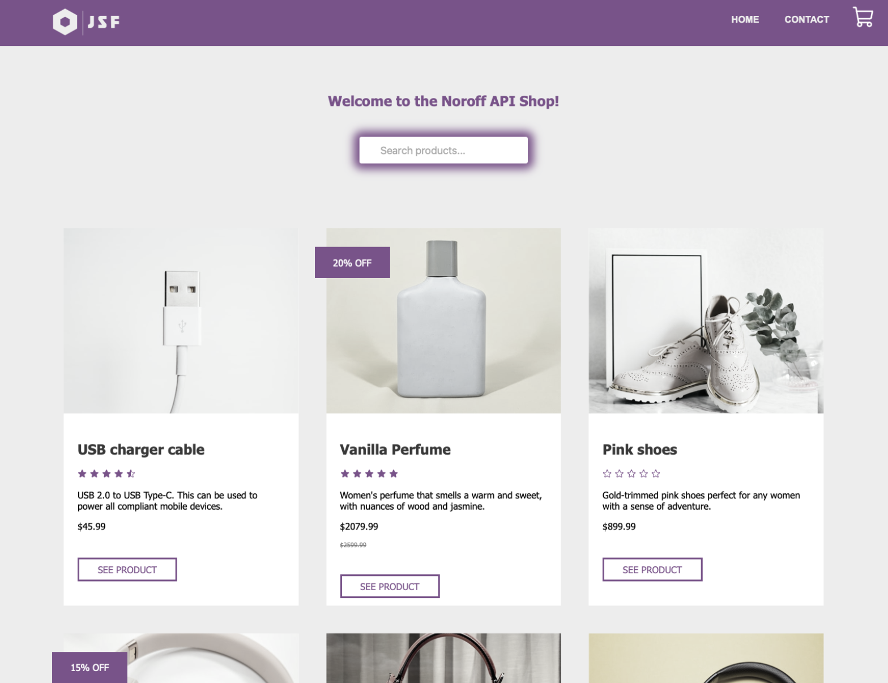
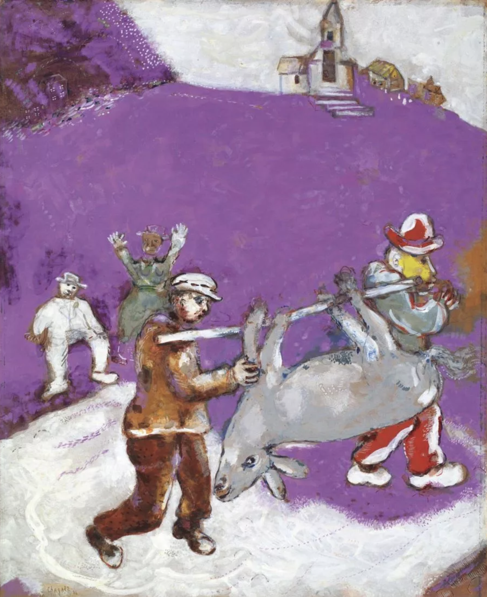

# JSF Shop

## Summary

This is my first React project, developed as a Course Assignment for the Frontend Development programme at Noroff.

- 
- 

## Built with

- React (CRA)
- Styled Components
- HTML
- git
- VS Code
- [Noroff API](https://docs.noroff.dev/)

## Instructions

- `npm install`: Starts node and installs dependencies

## Dependencies

- phosphor-react
- react-router-dom
- styled-components
- yup

## Contributions

For suggestions and contributions, please fork this repository and open new pull requests. The main branch is protected. You're also welcome to post post on the [issues](https://github.com/NehGuk/noroff-shop/issues) tab.

## Curiosity

The AA-compliant colour palette that I use in this project has been inspired by [Marc Chagall](https://en.wikipedia.org/wiki/Marc_Chagall)'s _The miller, his son and the donkey_.

